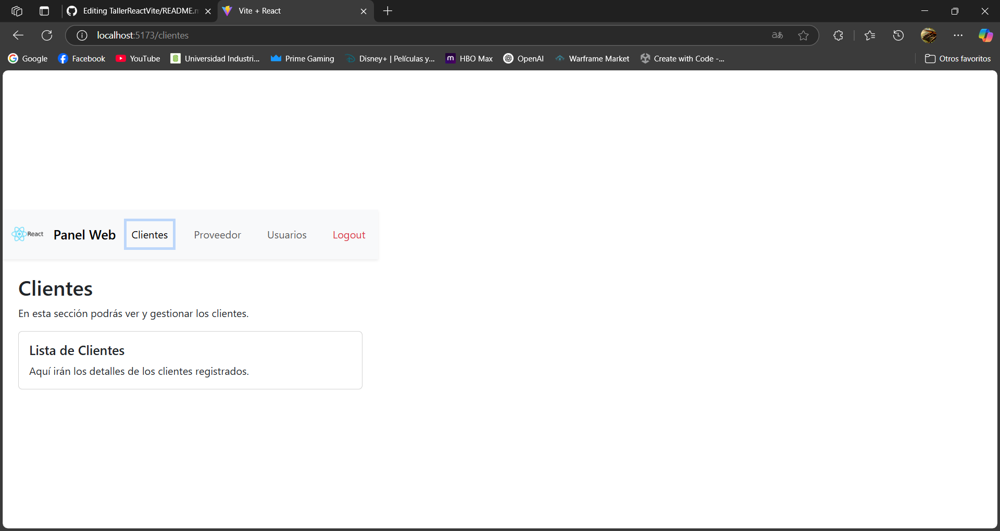

# Panel Administrativo con React y Vite

Este proyecto es una simulación de un **panel administrativo web** construido con **React**, **Vite** y **Bootstrap**. Incluye una barra de navegación moderna y vistas básicas para diferentes secciones administrativas.

## 🔧 Tecnologías utilizadas

- [React](https://reactjs.org/)
- [Vite](https://vitejs.dev/)
- [Bootstrap](https://getbootstrap.com/)
- [React Router DOM](https://reactrouter.com/)

## 📁 Estructura del proyecto

```
panel-react/
├── public/
│   └── logo.png
├── src/
│   ├── components/
│   │   └── Navbar.jsx
│   ├── pages/
│   │   ├── Clientes.jsx
│   │   ├── Proveedor.jsx
│   │   ├── Usuarios.jsx
│   │   └── Logout.jsx
│   ├── App.jsx
│   ├── main.jsx
│   └── index.css
├── README.md
└── package.json
```
## 📋 Pasos Seguidos

1. **Crear el proyecto con Vite:**
   - Se usó `npm create vite@latest` para iniciar el proyecto con la plantilla de **React**.
   - Se eligió **React** como la plantilla en el asistente interactivo de Vite.

2. **Instalar dependencias:**
   - Se ejecutó `npm install` para instalar las dependencias necesarias como React y Vite.

3. **Instalar Bootstrap:**
   - Se integró **Bootstrap** para estilizar la aplicación ejecutando `npm install bootstrap`.
   - En el archivo `src/main.jsx`, se importó el archivo CSS de Bootstrap con:
     ```javascript
     import 'bootstrap/dist/css/bootstrap.min.css';
     ```

4. **Configurar la barra de navegación:**
   - Se creó el componente **Navbar** en `src/components/Navbar.jsx`.
   - Se agregó un logo y enlaces de navegación con **React Router** para manejar la navegación sin recargar la página.

5. **Configurar rutas:**
   - Se configuraron las rutas para las secciones **Clientes**, **Proveedor**, **Usuarios** y **Logout** utilizando **React Router DOM** en el archivo `src/App.jsx`.

6. **Crear las vistas para cada sección:**
   - Se crearon las páginas correspondientes dentro de `src/pages/Clientes.jsx`, `src/pages/Proveedor.jsx`, `src/pages/Usuarios.jsx` y `src/pages/Logout.jsx`.
   - Cada una tiene un contenido básico de ejemplo para que se pueda visualizar correctamente al navegar.

7. **Ajustar el diseño:**
   - Se aplicaron clases de Bootstrap para asegurarse de que la página se vea ordenada y responsiva.


## 🚀 Cómo ejecutar el proyecto

1. Clona este repositorio:
   ```bash
   git clone https://github.com/tu-usuario/panel-react.git
   cd panel-react
   ```

2. Instala las dependencias:
   ```bash
   npm install
   ```

3. Ejecuta el servidor de desarrollo:
   ```bash
   npm run dev
   ```

4. Abre tu navegador y entra a:
   ```
   http://localhost:5173
   ```

## ✨ Funcionalidades

- Barra de navegación fija en la parte superior con:
  - Logo
  - Enlaces a: Clientes, Proveedor, Usuarios y Logout
- Cada sección muestra una vista básica con estilo.
- Navegación sin recarga usando React Router.

## 🖼 Captura de pantalla



---

_Desarrollado con 💻 por Miguel Daniel Velandia Pinilla (Aidnalev)_
